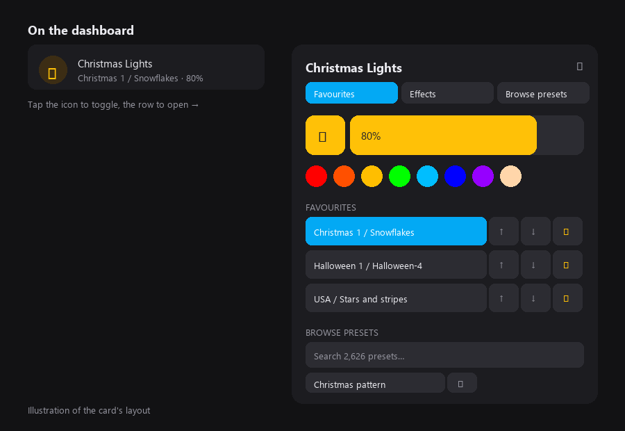

# Gouly Card

A Lovelace card for [ha-gouly](https://github.com/mikemaat/ha-gouly): one compact row on your
dashboard, with colour, brightness, effects, presets and favourites behind a single tap.

> Not affiliated with or endorsed by Gouly.



*Illustration of the layout.*

## What it does

The row shows the light's name and what it's currently doing. Tapping the icon toggles the light,
tapping the rest opens a dialog with:

- **Light**: Home Assistant's own light controls (the same slider, buttons and colour picker as the
  standard more-info dialog), or the card's own equivalent if that control can't be embedded
- **Favourites**: your favourite presets as one-tap buttons, sorted alphabetically
- **Effects**: all 140 effects with a search box and the effect speed slider
- **Browse presets**: the folder list, a search box, and a button to add the current preset to favourites

It drives the entities the integration already creates, so there's nothing extra to configure.

## Install

**With HACS**

1. HACS → ⋮ → **Custom repositories** → add `https://github.com/mikemaat/ha-gouly-card`, type **Dashboard**.
2. Search for **Gouly Card**, download it, and reload your browser.

**Manually**

1. Copy `gouly-card.js` into your Home Assistant `config/www` folder.
2. Settings → Dashboards → ⋮ → **Resources** → add `/local/gouly-card.js` as a **JavaScript module**.
3. Reload your browser.

## Use

Add a **Manual** card:

```yaml
type: custom:gouly-card
entity: light.christmas_lights_front
```

`entity` is the only required option. The card finds the preset, effect speed and favourite
entities from the same device.

| Option | Default | What it does |
|---|---|---|
| `entity` | required | The Gouly light |
| `name` | the light's name | Title shown on the row and dialog |
| `icon` | `mdi:snowflake` | Icon on the row; tap it to toggle the light |
| `select_preset_folder` | found automatically | Preset folder select entity |
| `select_preset` | found automatically | Preset select entity |
| `number_effect_speed` | found automatically | Effect speed number entity |
| `button_add_preset_to_favourites` | found automatically | Favourite button entity |

## License

[MIT](LICENSE)
